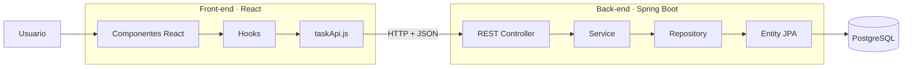
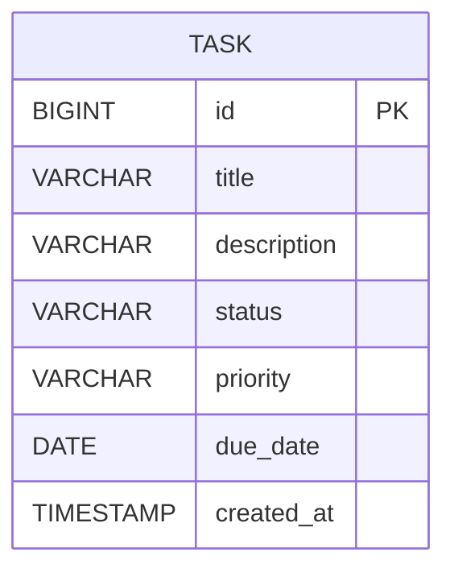

# Lab6-G4-AppToDo
First app to intagrate technologies needed to create a basic service software structure
# LABORATORIO · ToDo FULL STACK

**Escuela Colombiana de Ingeniería Julio Garavito**  
**Curso:** Desarrollo y Operaciones de Software - DOSW  
**Caso de estudio:** ToDo · Sistema para gestión de tareas  
**Docente:** Rodrigo Gualtero  

---

# 1. Requerimientos funcionales

La aplicación **ToDo** permitirá gestionar tareas personales desde una interfaz web desarrollada en React.

La solución estará compuesta por:

- Back-end desarrollado con **Java + Spring Boot + Maven**.
- API REST para exponer las operaciones sobre tareas.
- Persistencia con **PostgreSQL**.
- PostgreSQL ejecutado mediante **Docker**, descargando y utilizando directamente la imagen oficial de PostgreSQL.
- Persistencia implementada con **JPA + Spring Data JPA**.
- Front-end desarrollado con **React + Vite**.
- Comunicación Front-end ↔ Back-end mediante consumo de recursos REST.
- Pruebas unitarias en Back-end y Front-end.

## RF-01 · Crear tareas

El usuario podrá registrar una nueva tarea indicando:

- título,
- descripción,
- prioridad,
- fecha límite.

El sistema asignará automáticamente:

- identificador,
- estado inicial,
- fecha de creación.

---

## RF-02 · Consultar tareas

El usuario podrá visualizar todas las tareas registradas.

Por cada tarea se deberá mostrar como mínimo:

- título,
- descripción,
- estado,
- prioridad,
- fecha límite.

---

## RF-03 · Consultar una tarea

El usuario podrá consultar el detalle de una tarea específica a partir de su identificador.

---

## RF-04 · Editar tareas

El usuario podrá modificar:

- título,
- descripción,
- estado,
- prioridad,
- fecha límite.

---

## RF-05 · Eliminar tareas

El usuario podrá eliminar una tarea existente.

---

## RF-06 · Gestionar el estado de una tarea

Una tarea podrá manejar los siguientes estados:

```text
PENDING
IN_PROGRESS
COMPLETED
```

---

## RF-07 · Gestionar prioridad

Las tareas podrán clasificarse con las siguientes prioridades:

```text
LOW
MEDIUM
HIGH
```

---

## RF-08 · Persistir la información

Toda la información de las tareas deberá almacenarse en PostgreSQL.

---

## RF-09 · Consumir la API desde React

Todas las operaciones del CRUD realizadas desde React deberán ejecutarse consumiendo recursos de la API REST.

El Front-end no manejará persistencia local como fuente principal de información.

---

## RF-10 · Manejo de errores

La API deberá responder correctamente cuando:

- una tarea no exista,
- se reciban datos inválidos,
- una operación no pueda completarse.

---

## RF-11 · Pruebas automatizadas

El sistema deberá incluir pruebas unitarias para:

- capa de servicios,
- controladores REST,
- componentes principales del Front-end.

---

# 2. Historias de usuario

## HU-01 · Crear una tarea

**Como** usuario de la aplicación  
**quiero** crear una tarea  
**para** registrar una actividad que debo realizar.

### Criterios de aceptación

- Se debe poder ingresar título.
- Se debe poder ingresar descripción.
- Se debe poder seleccionar prioridad.
- Se debe poder indicar fecha límite.
- La tarea debe iniciar en estado `PENDING`.
- La tarea debe almacenarse en PostgreSQL.
- La tarea debe aparecer inmediatamente en el listado después de ser creada.

---

## HU-02 · Consultar todas las tareas

**Como** usuario  
**quiero** visualizar las tareas registradas  
**para** conocer las actividades que tengo pendientes.

### Criterios de aceptación

- El sistema debe mostrar todas las tareas.
- Debe mostrarse estado.
- Debe mostrarse prioridad.
- Debe mostrarse fecha límite cuando exista.
- La información debe provenir de la API REST.

---

## HU-03 · Consultar una tarea

**Como** usuario  
**quiero** consultar una tarea específica  
**para** revisar toda su información.

### Criterios de aceptación

- La tarea debe poder consultarse por identificador.
- Si la tarea existe, la API debe responder `200 OK`.
- Si la tarea no existe, la API debe responder `404 Not Found`.

---

## HU-04 · Editar una tarea

**Como** usuario  
**quiero** modificar una tarea  
**para** mantener actualizada su información.

### Criterios de aceptación

- Se podrá modificar título.
- Se podrá modificar descripción.
- Se podrá modificar prioridad.
- Se podrá modificar fecha límite.
- Los cambios deben persistirse en PostgreSQL.
- La interfaz debe reflejar los cambios realizados.

---

## HU-05 · Cambiar estado de una tarea

**Como** usuario  
**quiero** cambiar el estado de una tarea  
**para** representar su avance.

### Criterios de aceptación

La tarea podrá utilizar los estados:

```text
PENDING
IN_PROGRESS
COMPLETED
```

---

## HU-06 · Eliminar una tarea

**Como** usuario  
**quiero** eliminar una tarea  
**para** retirar actividades que ya no necesito gestionar.

### Criterios de aceptación

- Solo se podrá eliminar una tarea existente.
- Después de eliminarla no deberá aparecer en el listado.
- La API debe responder `204 No Content`.

---

## HU-07 · Visualizar errores

**Como** usuario  
**quiero** recibir mensajes claros cuando una operación falle  
**para** entender qué ocurrió.

### Criterios de aceptación

- El Front-end debe informar errores de creación, consulta, actualización o eliminación.
- La API deberá utilizar códigos HTTP apropiados.
- No se deberá mostrar un error genérico `500` para situaciones correspondientes a `400` o `404`.

---

# 3. Bono · Vista semanal de calendario

## HU-B01 · Visualizar tareas en un calendario semanal

**Como** usuario  
**quiero** visualizar mis tareas en una vista de calendario semanal  
**para** identificar fácilmente qué actividades debo realizar cada día.

### Criterios de aceptación

- Deben mostrarse los siete días de la semana.
- Cada tarea debe mostrarse en el día correspondiente a `dueDate`.
- Se debe poder navegar a la semana anterior.
- Se debe poder navegar a la semana siguiente.
- Se debe mostrar prioridad.
- Se debe mostrar estado.
- Al seleccionar una tarea se debe poder editar.
- La información debe provenir de la misma API REST utilizada por el CRUD.

---

# 4. Arquitectura objetivo

La aplicación deberá implementar una arquitectura similar a la siguiente:



---

# 5. Modelo de datos

Una tarea tendrá como mínimo:

| Campo | Tipo | Obligatorio | Descripción |
|---|---|---:|---|
| `id` | Long | Sí | Identificador único |
| `title` | String | Sí | Título |
| `description` | String | No | Descripción |
| `status` | Enum | Sí | Estado |
| `priority` | Enum | Sí | Prioridad |
| `dueDate` | LocalDate | No | Fecha límite |
| `createdAt` | LocalDateTime | Sí | Fecha de creación |

Estados:

```text
PENDING
IN_PROGRESS
COMPLETED
```

Prioridades:

```text
LOW
MEDIUM
HIGH
```

---

# 6. Modelo entidad-relación



---

# PARTE 1 · SCAFFOLDING DEL PROYECTO

# 7. Crear la estructura base

Crear un repositorio con la siguiente estructura:

```text
todo-fullstack/
│
├── backend/
├── frontend/
├── database/
│   └── 001_create_schema.sql
│
├── docs/
│   └── evidence/
│
└── README.md
```

---

# 8. Crear el Back-end con Spring Initializr

Ingresar a:

https://start.spring.io/

Configurar:

```text
Project: Maven
Language: Java
Packaging: Jar
Java: 17
```

Metadata:

```text
Group:
edu.eci.dosw

Artifact:
todo-api

Name:
todo-api

Package:
edu.eci.dosw.todo
```

Dependencias:

- Spring Web
- Spring Data JPA
- PostgreSQL Driver
- Validation
- Spring Boot Starter Test

Ubicar el proyecto generado dentro de:

```text
backend/
```

Verificar:

```bash
cd backend
mvn clean test
```

Ejecutar:

```bash
mvn spring-boot:run
```

---

# 9. Crear la estructura del Back-end

Crear los paquetes:

```text
backend/
└── src/
    ├── main/
    │   └── java/
    │       └── edu/eci/dosw/todo/
    │
    │           ├── controller/
    │           ├── service/
    │           ├── repository/
    │           ├── entity/
    │           ├── dto/
    │           ├── exception/
    │           ├── config/
    │           └── TodoApplication.java
    │
    └── test/
        └── java/
            └── edu/eci/dosw/todo/
```

---

# PARTE 2 · POSTGRESQL CON DOCKER

# 10. Descargar la imagen oficial de PostgreSQL

Para este laboratorio **no se instalará PostgreSQL directamente en el equipo**.

La idea es utilizar la imagen oficial disponible en Docker Hub.

Descargar la imagen:

```bash
docker pull postgres:17-alpine
```

Verificar que la imagen esté disponible localmente:

```bash
docker images
```

Deberá aparecer una imagen similar a:

```text
REPOSITORY   TAG         IMAGE ID       CREATED        SIZE
postgres     17-alpine   ...
```

---

# 11. Crear el script de base de datos

Crear:

```text
database/001_create_schema.sql
```

Contenido:

```sql
CREATE TABLE tasks (

    id BIGSERIAL PRIMARY KEY,

    title VARCHAR(120) NOT NULL,

    description VARCHAR(500),

    status VARCHAR(20) NOT NULL DEFAULT 'PENDING',

    priority VARCHAR(10) NOT NULL DEFAULT 'MEDIUM',

    due_date DATE,

    created_at TIMESTAMP NOT NULL DEFAULT CURRENT_TIMESTAMP,

    CONSTRAINT chk_task_status
        CHECK (status IN ('PENDING', 'IN_PROGRESS', 'COMPLETED')),

    CONSTRAINT chk_task_priority
        CHECK (priority IN ('LOW', 'MEDIUM', 'HIGH'))
);
```

---

# 12. Crear el contenedor PostgreSQL

Crear un volumen para conservar la información de la base de datos:

```bash
docker volume create todo-postgres-data
```

Luego crear y ejecutar el contenedor:

```bash
docker run -d \
  --name todo-postgres \
  -e POSTGRES_DB=todo_db \
  -e POSTGRES_USER=todo_user \
  -e POSTGRES_PASSWORD=todo_password \
  -p 5432:5432 \
  -v todo-postgres-data:/var/lib/postgresql/data \
  postgres:17-alpine
```

En Windows PowerShell puede ejecutarse en una sola línea:

```powershell
docker run -d --name todo-postgres -e POSTGRES_DB=todo_db -e POSTGRES_USER=todo_user -e POSTGRES_PASSWORD=todo_password -p 5432:5432 -v todo-postgres-data:/var/lib/postgresql/data postgres:17-alpine
```

Verificar que el contenedor esté ejecutándose:

```bash
docker ps
```

Consultar los logs:

```bash
docker logs todo-postgres
```

---

# 13. Crear el esquema dentro de PostgreSQL

Copiar el script SQL al contenedor:

```bash
docker cp database/001_create_schema.sql todo-postgres:/001_create_schema.sql
```

Ejecutar el script:

```bash
docker exec -i todo-postgres \
  psql -U todo_user -d todo_db \
  -f /001_create_schema.sql
```

En Windows PowerShell:

```powershell
docker exec -i todo-postgres psql -U todo_user -d todo_db -f /001_create_schema.sql
```

Conectarse a PostgreSQL:

```bash
docker exec -it todo-postgres psql -U todo_user -d todo_db
```

Dentro de PostgreSQL verificar la tabla:

```sql
\dt
```

y consultar:

```sql
SELECT * FROM tasks;
```

Salir:

```text
\q
```

---

# 14. Detener y volver a iniciar PostgreSQL

Para detener el contenedor:

```bash
docker stop todo-postgres
```

Para iniciarlo nuevamente:

```bash
docker start todo-postgres
```

Si se desea eliminar completamente el contenedor:

```bash
docker rm -f todo-postgres
```

El volumen seguirá existiendo y conservará los datos.

Para eliminar también los datos:

```bash
docker volume rm todo-postgres-data
```

---

# PARTE 3 · MAPEO ORM CON JPA

# 15. Crear los enums

Crear:

```text
entity/TaskStatus.java
```

```java
public enum TaskStatus {
    PENDING,
    IN_PROGRESS,
    COMPLETED
}
```

Crear:

```text
entity/TaskPriority.java
```

```java
public enum TaskPriority {
    LOW,
    MEDIUM,
    HIGH
}
```

---

# 16. Crear la entidad

Crear:

```text
entity/TaskEntity.java
```

Debe utilizar:

```java
@Entity
@Table(name = "tasks")
```

y mapear:

```text
id
title
description
status
priority
dueDate
createdAt
```

Utilizar, según corresponda:

```java
@Id
@GeneratedValue
@Column
@Enumerated
```

---

# 17. Configurar PostgreSQL en Spring Boot

En:

```text
application.properties
```

adicionar:

```properties
spring.datasource.url=${DB_URL:jdbc:postgresql://localhost:5432/todo_db}
spring.datasource.username=${DB_USER:todo_user}
spring.datasource.password=${DB_PASSWORD:todo_password}

spring.jpa.hibernate.ddl-auto=validate

spring.jpa.show-sql=true
spring.jpa.properties.hibernate.format_sql=true
```

---

# 18. Crear el Repository

Crear:

```text
repository/TaskRepository.java
```

Debe extender:

```java
JpaRepository<TaskEntity, Long>
```

---

# PARTE 4 · DTOs

# 19. Crear los DTOs

Crear:

```text
dto/TaskCreateRequest.java
dto/TaskUpdateRequest.java
dto/TaskResponse.java
```

## TaskCreateRequest

Debe recibir:

```text
title
description
priority
dueDate
```

No debe recibir:

```text
id
createdAt
```

---

## TaskUpdateRequest

Debe permitir modificar:

```text
title
description
status
priority
dueDate
```

---

## TaskResponse

Debe retornar:

```text
id
title
description
status
priority
dueDate
createdAt
```

---

# PARTE 5 · CAPA DE SERVICIOS

# 20. Crear la interfaz TaskService

Crear:

```text
service/TaskService.java
```

Definir:

```java
List<TaskResponse> findAll();

TaskResponse findById(Long id);

TaskResponse create(TaskCreateRequest request);

TaskResponse update(Long id, TaskUpdateRequest request);

void delete(Long id);
```

---

# 21. Crear TaskServiceImpl

Crear:

```text
service/TaskServiceImpl.java
```

Utilizar:

```java
@Service
```

e inyección por constructor.

La implementación deberá:

- consultar el Repository,
- transformar Entity ↔ DTO,
- asignar valores por defecto,
- validar existencia de tareas,
- actualizar tareas,
- eliminar tareas,
- lanzar excepciones cuando corresponda.

---

# 22. Valores por defecto

Al crear una tarea:

```text
status = PENDING
priority = MEDIUM
createdAt = fecha y hora actual
```

La prioridad enviada por el usuario puede reemplazar el valor `MEDIUM`.

---

# PARTE 6 · PRUEBAS UNITARIAS DEL SERVICE

# 23. Crear TaskServiceTest

Crear:

```text
TaskServiceTest.java
```

Utilizar:

```text
JUnit 5
Mockito
AssertJ
```

El `TaskRepository` debe ser un Mock.

Casos mínimos:

```text
findAll_shouldReturnTasks

findById_shouldReturnTaskWhenExists

findById_shouldThrowExceptionWhenTaskDoesNotExist

create_shouldCreateTask

create_shouldAssignDefaultStatus

update_shouldUpdateExistingTask

update_shouldThrowExceptionWhenTaskDoesNotExist

delete_shouldDeleteExistingTask

delete_shouldThrowExceptionWhenTaskDoesNotExist
```

Ejecutar:

```bash
mvn test
```

---

# 24. JaCoCo

Adicionar JaCoCo al `pom.xml`.

Ejecutar:

```bash
mvn clean verify
```

Revisar:

```text
backend/target/site/jacoco/index.html
```

Meta sugerida:

```text
80 %
```

---

# PARTE 7 · API REST

# 25. Crear TaskController

Crear:

```text
controller/TaskController.java
```

Utilizar:

```java
@RestController
@RequestMapping("/api/v1/tasks")
```

---

# 26. Endpoints requeridos

| Operación | Método | Endpoint | Código |
|---|---|---|---:|
| Listar tareas | GET | `/api/v1/tasks` | 200 |
| Consultar tarea | GET | `/api/v1/tasks/{id}` | 200 / 404 |
| Crear tarea | POST | `/api/v1/tasks` | 201 |
| Actualizar tarea | PUT | `/api/v1/tasks/{id}` | 200 / 404 |
| Eliminar tarea | DELETE | `/api/v1/tasks/{id}` | 204 / 404 |

---

# 27. Crear tarea

```http
POST /api/v1/tasks
Content-Type: application/json
```

```json
{
  "title": "Terminar laboratorio DOSW",
  "description": "Completar pruebas del backend",
  "priority": "HIGH",
  "dueDate": "2026-09-25"
}
```

Respuesta:

```http
201 Created
```

```json
{
  "id": 1,
  "title": "Terminar laboratorio DOSW",
  "description": "Completar pruebas del backend",
  "status": "PENDING",
  "priority": "HIGH",
  "dueDate": "2026-09-25",
  "createdAt": "2026-09-21T10:30:00"
}
```

---

# 28. Consultar todas las tareas

```http
GET /api/v1/tasks
```

---

# 29. Consultar una tarea

```http
GET /api/v1/tasks/1
```

Si no existe:

```http
404 Not Found
```

---

# 30. Actualizar tarea

```http
PUT /api/v1/tasks/1
Content-Type: application/json
```

```json
{
  "title": "Terminar laboratorio DOSW",
  "description": "Backend y Front-end terminados",
  "status": "IN_PROGRESS",
  "priority": "HIGH",
  "dueDate": "2026-09-25"
}
```

---

# 31. Eliminar tarea

```http
DELETE /api/v1/tasks/1
```

Respuesta:

```http
204 No Content
```

---

# PARTE 8 · MANEJO DE ERRORES

# 32. Crear TaskNotFoundException

Crear:

```text
exception/TaskNotFoundException.java
```

---

# 33. Crear GlobalExceptionHandler

Crear:

```text
exception/GlobalExceptionHandler.java
```

Utilizar:

```java
@RestControllerAdvice
```

Ejemplo:

```json
{
  "status": 404,
  "message": "Task with id 99 was not found"
}
```

---

# PARTE 9 · PRUEBAS DEL CONTROLLER

# 34. Crear TaskControllerTest

Crear:

```text
TaskControllerTest.java
```

Utilizar:

```text
MockMvc
Mockito
ObjectMapper
```

El Service debe ser simulado.

Casos mínimos:

```text
GET /tasks → 200

GET /tasks/{id}
    existente → 200
    inexistente → 404

POST /tasks
    válido → 201
    inválido → 400

PUT /tasks/{id}
    existente → 200
    inexistente → 404

DELETE /tasks/{id}
    existente → 204
```

---

# PARTE 10 · PROBAR EL BACK-END

# 35. Ejecutar PostgreSQL

Si el contenedor ya fue creado:

```bash
docker start todo-postgres
```

Verificar:

```bash
docker ps
```

---

# 36. Ejecutar Spring Boot

```bash
cd backend
mvn spring-boot:run
```

---

# 37. Probar la API

Puede utilizarse:

```text
Postman
Bruno
Insomnia
curl
```

Ejemplo:

```bash
curl http://localhost:8080/api/v1/tasks
```

---

# PARTE 11 · FRONT-END CON REACT

# 38. Crear React con Vite

Desde la raíz:

```bash
npm create vite@latest frontend -- --template react
```

Instalar:

```bash
cd frontend
npm install
```

Ejecutar:

```bash
npm run dev
```

Aplicación:

```text
http://localhost:5173
```

---

# 39. Estructura sugerida

```text
frontend/
└── src/
    │
    ├── api/
    │   └── taskApi.js
    │
    ├── features/
    │   └── tasks/
    │       │
    │       ├── components/
    │       │   ├── TaskForm.jsx
    │       │   ├── TaskList.jsx
    │       │   └── TaskItem.jsx
    │       │
    │       ├── hooks/
    │       │   └── useTasks.js
    │       │
    │       └── pages/
    │           └── TasksPage.jsx
    │
    ├── App.jsx
    └── main.jsx
```

---

# 40. TaskForm

Crear un formulario para:

```text
Título
Descripción
Prioridad
Fecha límite
```

Debe servir para:

```text
Crear tarea
Editar tarea
```

---

# 41. TaskList

Mostrar:

```text
Título
Estado
Prioridad
Fecha límite
```

Acciones:

```text
Editar
Cambiar estado
Eliminar
```

---

# 42. Interfaz mínima

```text
-----------------------------------------------------
                    TO DO
-----------------------------------------------------

[ Nueva tarea ]

Título:       [________________________]

Descripción:  [________________________]

Prioridad:    [ MEDIUM v ]

Fecha límite: [ 2026-09-25 ]

              [ Guardar ]

-----------------------------------------------------

TAREAS

[HIGH] Terminar laboratorio
Estado: IN_PROGRESS
Fecha: 25/09/2026

[Editar] [Completar] [Eliminar]

-----------------------------------------------------

[MEDIUM] Preparar parcial
Estado: PENDING
Fecha: 27/09/2026

[Editar] [Iniciar] [Eliminar]

-----------------------------------------------------
```

---

# PARTE 12 · CONSUMO DE RECURSOS REST

# 43. Crear taskApi.js

Crear:

```text
src/api/taskApi.js
```

Ejemplo:

```javascript
const API_URL = "http://localhost:8080/api/v1/tasks";

export async function getTasks() {
    // TODO
}

export async function getTask(id) {
    // TODO
}

export async function createTask(task) {
    // TODO
}

export async function updateTask(id, task) {
    // TODO
}

export async function deleteTask(id) {
    // TODO
}
```

---

# 44. Crear useTasks

Crear:

```text
useTasks.js
```

Utilizar:

```text
useState
useEffect
```

Debe manejar:

```text
tasks
loading
error

loadTasks()
addTask()
editTask()
removeTask()
```

---

# 45. Configurar CORS

React:

```text
http://localhost:5173
```

Spring Boot:

```text
http://localhost:8080
```

Crear:

```text
config/WebConfig.java
```

y permitir el origen:

```text
http://localhost:5173
```

---

# PARTE 13 · PRUEBAS DEL FRONT-END

# 46. Herramientas

Utilizar:

```text
Vitest
React Testing Library
```

Crear:

```text
TaskForm.test.jsx
TaskList.test.jsx
TasksPage.test.jsx
```

---

# 47. Pruebas mínimas

## TaskForm

```text
Renderiza el formulario.
Permite escribir un título.
Ejecuta la acción guardar.
Valida el título obligatorio.
```

## TaskList

```text
Renderiza tareas.
Muestra estado.
Muestra prioridad.
Ejecuta eliminar.
```

## TasksPage

```text
Carga tareas.
Muestra loading.
Muestra error cuando falla la API.
```

Las llamadas HTTP deben ser simuladas.

---

# PARTE 14 · INTEGRACIÓN FULL STACK

# 48. Ejecutar PostgreSQL

```bash
docker start todo-postgres
```

Verificar:

```bash
docker ps
```

---

# 49. Ejecutar Back-end

```bash
cd backend
mvn spring-boot:run
```

---

# 50. Ejecutar Front-end

```bash
cd frontend
npm run dev
```

---

# 51. Demostración obligatoria

Desde React realizar:

```text
Crear tarea
    ↓
Consultar tareas
    ↓
Editar tarea
    ↓
Cambiar estado
    ↓
Eliminar tarea
```

Flujo esperado:

```text
React
   ↓
HTTP
   ↓
REST Controller
   ↓
Service
   ↓
Repository
   ↓
JPA / Hibernate
   ↓
PostgreSQL
```

---

# PARTE 15 · BONUS · VISTA DE CALENDARIO SEMANAL

# 52. Crear TaskCalendar

Crear un componente adicional:

```text
TaskCalendar.jsx
```

Debe mostrar:

```text
              SEMANA 21 - 27 SEPTIEMBRE

-------------------------------------------------------------
 LUN        MAR        MIÉ        JUE        VIE        SÁB       DOM
-------------------------------------------------------------

Lab DOSW              Parcial              Entrega
HIGH                  MEDIUM               HIGH

-------------------------------------------------------------

[ < Semana anterior ]          [ Semana siguiente > ]
```

---

# 53. Requisitos del calendario

La vista debe:

- mostrar los siete días,
- ubicar las tareas según `dueDate`,
- mostrar estado,
- mostrar prioridad,
- permitir semana anterior,
- permitir semana siguiente,
- permitir seleccionar una tarea para editar,
- actualizarse después de crear, modificar o eliminar una tarea.

---

# 54. Endpoint opcional para el bono

Se puede implementar:

```http
GET /api/v1/tasks?from=2026-09-21&to=2026-09-27
```

En el Repository:

```java
findByDueDateBetween(...)
```

---

# 55. Pruebas del calendario

Crear:

```text
TaskCalendar.test.jsx
```

Probar:

```text
Renderiza siete días.

Ubica una tarea en la fecha correspondiente.

Permite cambiar de semana.

No muestra tareas que pertenecen a otra semana.
```

---

# PARTE 16 · EVIDENCIAS

# 56. Evidencias requeridas

Guardar en:

```text
docs/evidence/
```

Evidencia de:

1. PostgreSQL en Docker.
2. Tabla `tasks`.
3. Pruebas de Service.
4. Pruebas de Controller.
5. Reporte JaCoCo.
6. API funcionando.
7. Aplicación React.
8. Creación desde React.
9. Edición desde React.
10. Eliminación desde React.
11. Pruebas Front-end.
12. Vista semanal si desarrolló el bono.

---

# 57. Resultado final esperado

El repositorio deberá tener una estructura similar a:

```text
todo-fullstack/
│
├── backend/
├── frontend/
├── database/
│   └── 001_create_schema.sql
├── docs/
│   └── evidence/
└── README.md
```

---

# 58. Checklist final

## Back-end

- [ ] Proyecto Maven.
- [ ] Spring Boot.
- [ ] Entidad JPA.
- [ ] Repository.
- [ ] Service.
- [ ] REST Controller.
- [ ] DTOs.
- [ ] Manejo de errores.
- [ ] PostgreSQL ejecutándose desde la imagen oficial de Docker.
- [ ] Pruebas unitarias.
- [ ] Reporte JaCoCo.

## Front-end

- [ ] React.
- [ ] Vite.
- [ ] TaskForm.
- [ ] TaskList.
- [ ] Edición.
- [ ] Eliminación.
- [ ] Cambio de estado.
- [ ] Consumo REST.
- [ ] useState.
- [ ] useEffect.
- [ ] Pruebas unitarias.

## Integración

- [ ] React consume Spring Boot.
- [ ] Spring Boot persiste en PostgreSQL.
- [ ] CRUD completo desde la interfaz.
- [ ] Docker ejecuta PostgreSQL.

## Bono

- [ ] Vista semanal.
- [ ] Navegación entre semanas.
- [ ] Tareas reales desde la API.
- [ ] Pruebas del calendario.

---


---

# PARTE 17 · INFORME FINAL DEL LABORATORIO

# 60. Informe de resultados

Al finalizar el laboratorio, el equipo deberá entregar un **informe corto en formato Markdown o PDF** dentro del repositorio.

Ubicación sugerida:

```text
docs/
└── informe-laboratorio.md
```

El informe debe contener:

1. Integrantes del equipo.
2. Enlace al repositorio.
3. Descripción breve de la solución implementada.
4. Arquitectura final de la aplicación.
5. Evidencias principales de funcionamiento.
6. Resultados de las pruebas.
7. Respuestas a las preguntas de análisis.
8. Enlace al video de demostración.

---

# 61. Preguntas de análisis

Las siguientes preguntas deben responderse con base en la solución realmente implementada.

No se busca copiar definiciones. Las respuestas deben explicar **cómo se aplicó cada concepto dentro de la aplicación ToDo**.

## Arquitectura

1. Explique qué sucede desde el momento en que el usuario presiona **Guardar tarea** en React hasta que la tarea queda almacenada en PostgreSQL.

2. ¿Qué responsabilidad tiene cada una de estas capas en su implementación?

```text
Controller
Service
Repository
Entity
DTO
```

3. ¿Por qué el Front-end no se conecta directamente a PostgreSQL?

4. ¿Qué problema tendría la aplicación si el Controller accediera directamente al Repository y además implementara allí la lógica de negocio?

---

## Persistencia

5. ¿Cómo se relaciona `TaskEntity` con la tabla `tasks` de PostgreSQL?

6. ¿Qué papel cumplen JPA, Hibernate y Spring Data JPA dentro de la solución?

7. ¿Qué operaciones del CRUD proporciona `JpaRepository` sin necesidad de implementarlas manualmente?

8. Explique por qué se utilizó:

```properties
spring.jpa.hibernate.ddl-auto=validate
```

en lugar de permitir que Hibernate cree automáticamente toda la estructura de la base de datos.

---

## API REST

9. Para cada operación del CRUD indique el método HTTP utilizado y explique por qué es apropiado:

```text
Crear
Consultar
Actualizar
Eliminar
```

10. ¿Cuál es la diferencia entre responder:

```text
200 OK
201 Created
204 No Content
400 Bad Request
404 Not Found
500 Internal Server Error
```

11. ¿Qué información intercambian React y Spring Boot y en qué formato se realiza esta comunicación?

---

## React

12. ¿Qué responsabilidad tiene `taskApi.js` dentro del Front-end?

13. ¿Para qué utilizaron `useState` en la aplicación?

14. ¿Para qué utilizaron `useEffect`?

15. Explique cómo se actualiza la pantalla después de crear, editar o eliminar una tarea.

---

## Docker y PostgreSQL

16. ¿Qué ventaja tuvo utilizar la imagen oficial de PostgreSQL en Docker en lugar de instalar PostgreSQL directamente en cada computador?

17. Explique la diferencia entre:

```bash
docker pull
docker run
docker stop
docker start
docker exec
```

18. ¿Por qué se utilizó un volumen Docker para PostgreSQL?

19. ¿Qué ocurriría con la información almacenada si se elimina el contenedor pero se conserva el volumen?

---

## Pruebas

20. ¿Por qué las pruebas unitarias del Service no deberían depender de una instancia real de PostgreSQL?

21. ¿Qué dependencia se simuló con Mockito al probar `TaskService` y por qué?

22. ¿Qué dependencia se simuló al probar `TaskController`?

23. Mencione un error que haya sido detectado por una prueba durante el desarrollo y explique cómo fue corregido.

24. ¿Qué información proporciona JaCoCo y por qué un porcentaje alto de cobertura no garantiza por sí solo que las pruebas sean buenas?

---

## Integración

25. Dibuje o incluya un diagrama sencillo del flujo completo:

```text
React
   ↓
API REST
   ↓
Controller
   ↓
Service
   ↓
Repository
   ↓
JPA / Hibernate
   ↓
PostgreSQL
```

y explique con sus propias palabras cómo se comunican estas partes.

---

# PARTE 18 · VIDEO DE FUNCIONAMIENTO

# 62. Video obligatorio

Cada equipo deberá entregar un video corto mostrando el funcionamiento completo de la aplicación.

Duración recomendada:

```text
5 a 8 minutos
```

El video debe mostrar la aplicación funcionando **completamente en ambiente local**.

No se requiere despliegue en Internet.

---

# 63. Qué debe aparecer en el video

El video deberá mostrar, como mínimo, el siguiente recorrido.

## 1. PostgreSQL en Docker

Mostrar la imagen descargada:

```bash
docker images
```

Mostrar el contenedor ejecutándose:

```bash
docker ps
```

Mostrar que la tabla existe:

```bash
docker exec -it todo-postgres psql -U todo_user -d todo_db
```

y ejecutar:

```sql
SELECT * FROM tasks;
```

---

## 2. Back-end

Mostrar Spring Boot ejecutándose localmente:

```bash
cd backend
mvn spring-boot:run
```

La API deberá estar disponible en:

```text
http://localhost:8080
```

---

## 3. Pruebas del Back-end

Ejecutar:

```bash
mvn clean test
```

o:

```bash
mvn clean verify
```

Mostrar que las pruebas terminan correctamente.

---

## 4. Front-end

Mostrar React ejecutándose:

```bash
cd frontend
npm run dev
```

Abrir:

```text
http://localhost:5173
```

---

## 5. CRUD completo desde React

Desde la interfaz se debe demostrar:

```text
Crear una tarea
        ↓
Consultar las tareas
        ↓
Editar una tarea
        ↓
Cambiar su estado
        ↓
Eliminar la tarea
```

Todas estas operaciones deben realizarse desde React.

No es suficiente mostrar únicamente las peticiones en Postman.

---

## 6. Evidencia de persistencia

Durante el video se debe demostrar que una operación realizada desde React realmente modifica PostgreSQL.

Por ejemplo:

1. Crear una tarea desde React.
2. Consultar PostgreSQL.
3. Mostrar que la nueva tarea aparece en la tabla.

Luego se puede modificar o eliminar desde React y volver a consultar la base.

---

## 7. Pruebas del Front-end

Ejecutar las pruebas configuradas con Vitest.

Ejemplo:

```bash
npm test
```

o el comando definido por el equipo en `package.json`.

Mostrar que las pruebas terminan correctamente.

---

## 8. Bono de calendario

Si el equipo implementó el bono, deberá mostrar:

- vista semanal,
- navegación entre semanas,
- tareas ubicadas según `dueDate`,
- edición de una tarea desde la vista,
- actualización del calendario después de modificar los datos.

---

# 64. Explicación durante el video

El video no debe limitarse a mostrar pantallas.

Cada integrante deberá participar explicando alguna parte de la solución.

Durante la demostración deben explicar brevemente:

- cómo React consume la API,
- cómo llega la petición al Controller,
- qué hace el Service,
- cómo interviene el Repository,
- cómo JPA persiste la información,
- dónde queda almacenada la información,
- cómo comprobaron el funcionamiento mediante pruebas.

---

# 65. Entrega del video

El video podrá publicarse en:

```text
YouTube como video no listado
Google Drive
OneDrive
```

El enlace deberá quedar registrado en:

```text
docs/informe-laboratorio.md
```

Ejemplo:

```markdown
## Video de demostración

https://...
```

El enlace debe tener permisos de visualización activos al momento de la entrega.

---

# 66. Entrega final

La entrega se considera completa cuando el repositorio contiene:

```text
todo-fullstack/
│
├── backend/
├── frontend/
├── database/
├── docs/
│   ├── evidence/
│   └── informe-laboratorio.md
└── README.md
```

y el informe incluye:

- respuestas a las preguntas,
- evidencias,
- resultados de las pruebas,
- enlace al video.

El video debe demostrar la aplicación funcionando localmente con:

```text
React
Spring Boot
PostgreSQL en Docker
```


# 59. Referencias

Spring Initializr  
https://start.spring.io/

Spring Boot  
https://spring.io/projects/spring-boot

Spring Data JPA  
https://spring.io/projects/spring-data-jpa

PostgreSQL  
https://www.postgresql.org/

Docker PostgreSQL  
https://hub.docker.com/_/postgres

React  
https://react.dev/

Vite  
https://vite.dev/

Vitest  
https://vitest.dev/

React Testing Library  
https://testing-library.com/docs/react-testing-library/intro/

